# 微金所项目（一）

## 1.Bootstrap初始化模板

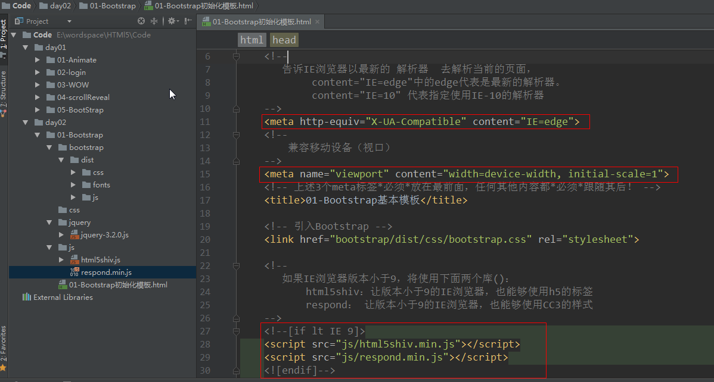

```
<!DOCTYPE html>
<html lang="zh-CN">
<head>
    <!--设置编码 gbk gb2312 utf-8-->
    <meta charset="utf-8">
    <!--
       告诉IE浏览器以最新的 解析器  去解析当前的页面，
            content="IE=edge"中的edge代表是最新的解析器。
            content="IE=10" 代表指定使用IE-10的解析器
    -->
    <meta http-equiv="X-UA-Compatible" content="IE=edge">
    <!--
        兼容移动设备（视口）
    -->
    <meta name="viewport" content="width=device-width, initial-scale=1">
    <!-- 上述3个meta标签*必须*放在最前面，任何其他内容都*必须*跟随其后！ -->
    <title>01-Bootstrap基本模板</title>

    <!-- 引入Bootstrap -->
    <link href="bootstrap/dist/css/bootstrap.css" rel="stylesheet">

    <!--
       如果IE浏览器版本小于9，将使用下面两个库()：
           html5shiv：让版本小于9的IE浏览器，也能够使用h5的标签
           respond： 让版本小于9的IE浏览器，也能够使用C3的样式
    -->
    <!--[if lt IE 9]>
    <script src="js/html5shiv.min.js"></script>
    <script src="js/respond.min.js"></script>
    <![endif]-->

</head>
<body>

<h1>你好，世界！</h1>

<!-- Bootstrap这个个框架依赖jQuery; jquery从1.9版本开始不再兼任ie9以下浏览器 -->
<script src="jquery/jquery-3.2.0.js"></script>

<script src="bootstrap/dist/js/bootstrap.js"></script>

</body>
</html>
```

查看ie浏览器的解析器：

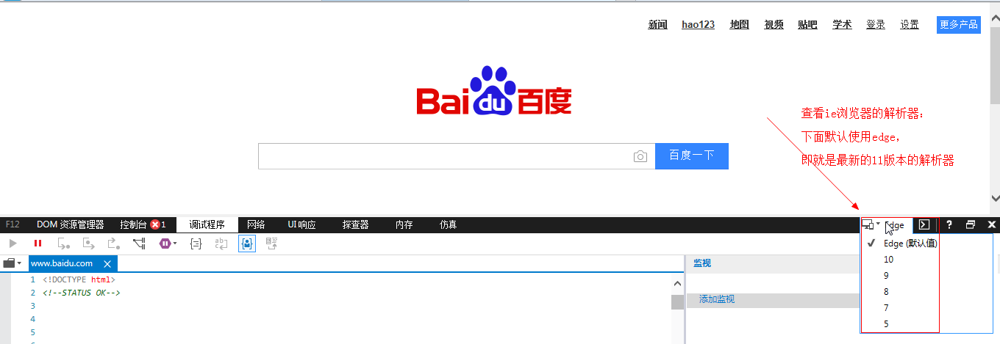

## 2.视口

视口其实是一个虚拟的窗口 ，默认的尺寸是980像素;
为了兼容移动设备，一般让视口的宽度和设备的宽度的比例为 1:1;

```
<meta name="viewport"
          content="width=device-width, user-scalable=no, initial-scale=1.0, maximum-scale=1.0, minimum-scale=1.0">
```

## 3.Bootstrap常用的组件

1.面板

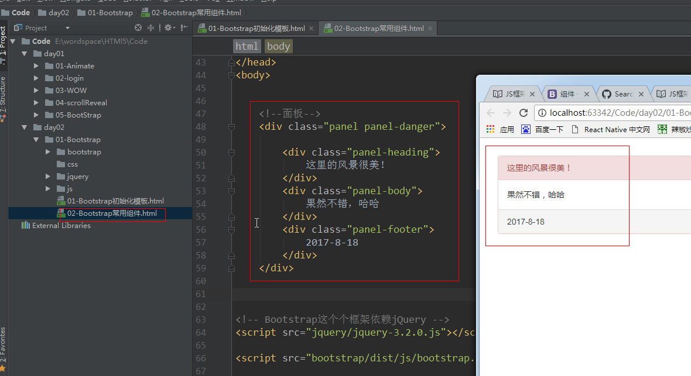

2.徽章

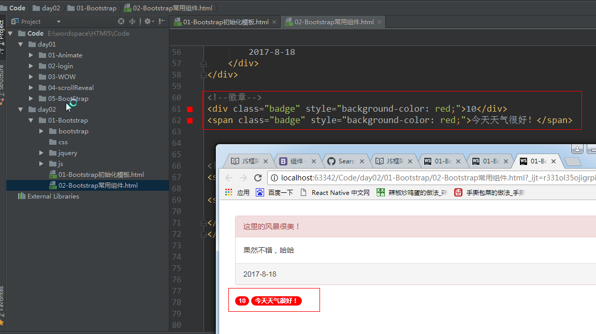

3.模态框

```
   调出模态框:
   data-target="#myModal"   指定弹出的目标（值是：选择器）
   data-toggle="modal"      指定以模态框的方式弹出
   data-dismiss="modal"     指定以模态框的方式消失
```

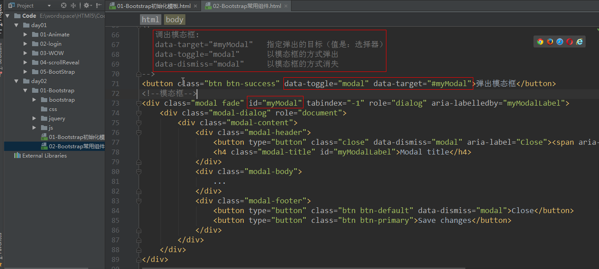

## 3.微金所项目搭建

### 1.搭建项目目录结构

```
├─ /weijinsuo/ ··················· 项目根目录
└─┬─ /css/ ······················· 项目CSS文件
  ├─ /font/ ······················ 使用到的字体文件
  ├─ /img/ ······················· 使用到的图片文件
  ├─ /js/ ························ 自己的JS脚本
  ├─ /lib/ ······················· 第三方类库
  ├─ /favicon.ico ················ 站点图标
  └─ /index.html ················· 入口文件
```

### 2.项目编码规范约定

#### 1 HTML约定

- 所有的CSS引用在HEAD中，按照第三方优先的顺序排列，我们自己的CSS肯定在最下面
- 所有JS文件都引用在Body的最下面（加载的缘由），按照依赖顺序排序
- 如果只是使用bootstrap的样式的话，就不用引用js文件
- 在head中引入必要的CSS文件，优先引用第三方的CSS，方便我们自己的样式覆盖
- 在body末尾引入必要的JS文件，优先引用第三方的JS，注意JS文件之间的依赖关系，比如bootstrap.js依赖jQuery，那就应该先引用jquery.js 然后引用bootstrap.js
- 特殊情况：如果js文件是用于处理一些css样式的，那一般在head中进行引入

#### 2 CSS约定

- 除了公共级别样式，其余样式全部加模块前缀
- 尽量使用 直接子代选择器， 少用间接子代  避免选错
- CSS类名冲突 通过约定 给模块加上一个独一无二的名字
- 使用子代选择器的方式

#### 3 JS约定

- 不允许使用onxxx = function(){}的方式注册事件( 为了做兼容 )
- 原生JS统一使用addEventListener('xxx', function(){});

### 3、项目默认配置设定

#### 1 HTML5文档结构

```
<!DOCTYPE html>
<html lang="zh-CN">
<head>
  <meta charset="UTF-8">
  <title>页面标题</title>
</head>
<body>

</body>
</html>
```

#### 2 Viewport设置

```
<meta name="viewport" content="width=device-width, user-scalable=no, initial-scale=1.0">
```

> html中插入视口设置，可以通过emmet __meta:vp__ 插入
>
> 此属性为移动端页面视口设置，当前值表示在移动端页面的宽度为设备的宽度，并且不缩放（缩放级别为1）
>
> 960px 内容 被套在一个宽度为980px(绝大多数设备的视口默认尺寸)的容器(视口)中，将视口缩放到设备的真实尺寸中进行展示

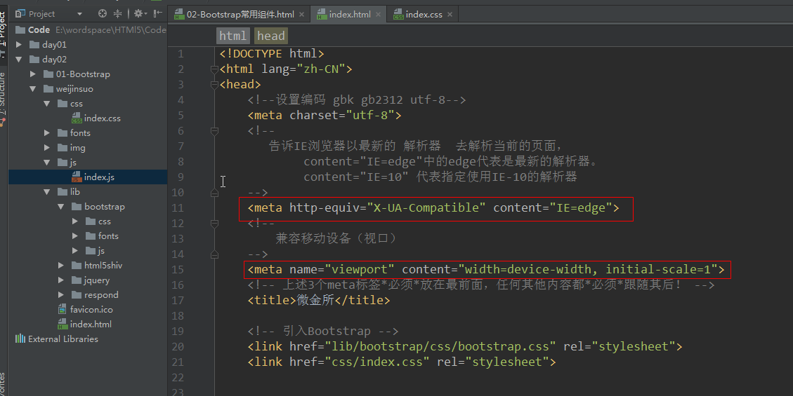

#### 3 浏览器兼容模式

```
<meta http-equiv="X-UA-Compatible" content="IE=edge">
```

> html中插入兼容模式设置，可以通过emmet __meta:compat__ 插入
>
> 此属性为文档兼容模式声明，表示如果在IE浏览器下则使用最新的标准渲染当前文档


#### 4 favicon（站点图标）

```
<link rel="shortcut icon" type="image/x-icon" href="favicon.ico">
```

> html中插入图标链接，可以通过emmet __link:favicon__ 插入

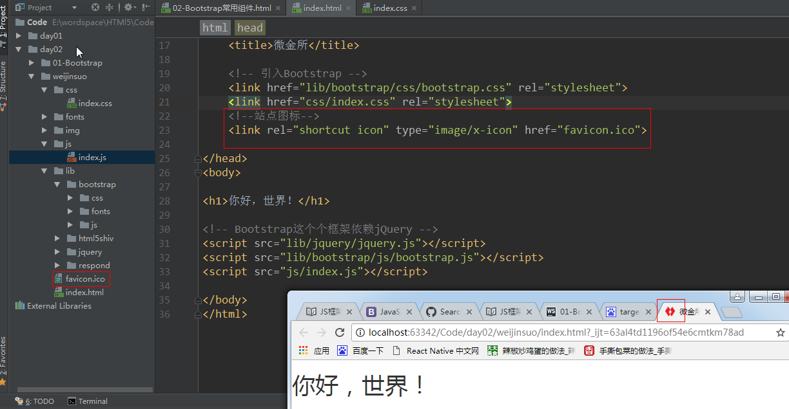

#### 5 引入相应的第三方文件

```
<link rel="stylesheet" href="bootstrap.css">
<link rel="stylesheet" href="index.css">
...
<script src="jquery.js"></script>
<script src="bootstrap.js"></script>
<script src="index.js"></script>
```

#### 6 设置默认字体

```
body{
  font-family: "Helvetica Neue", 
                Helvetica, 
                Microsoft Yahei, 
                Hiragino Sans GB, 
                WenQuanYi Micro Hei, 
                sans-serif;
}
```

### 4、项目结构搭建

#### 1 完成页面空结构搭建

先划分好页面中的大容器，然后在具体看每一个容器中单独的情况

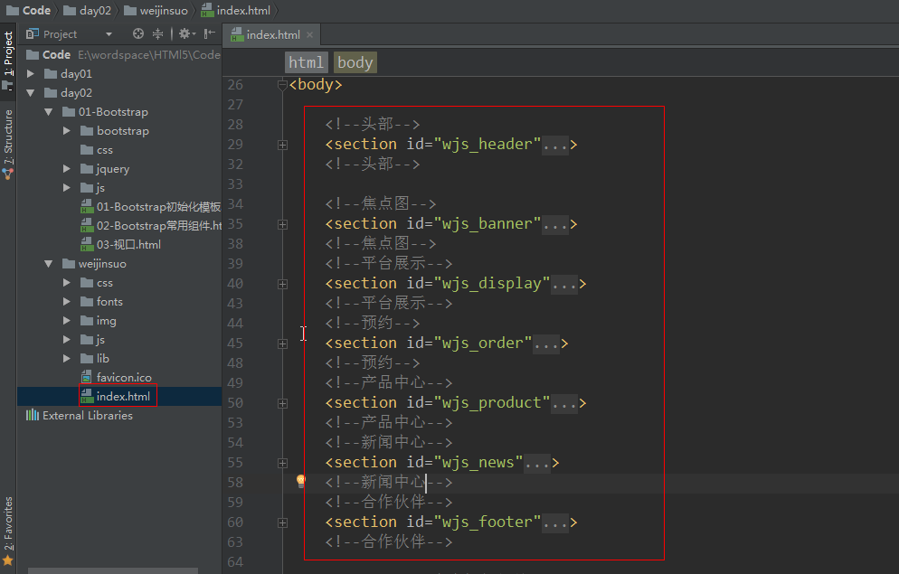

```

    <!--头部-->
    <section id="wjs_header">

    </section>
    <!--头部-->

    <!--焦点图-->
    <section id="wjs_banner">

    </section>
    <!--焦点图-->
    <!--平台展示-->
    <section id="wjs_display">

    </section>
    <!--平台展示-->
    <!--预约-->
    <section id="wjs_order">

    </section>
    <!--预约-->
    <!--产品中心-->
    <section id="wjs_product">

    </section>
    <!--产品中心-->
    <!--新闻中心-->
    <section id="wjs_news">

    </section>
    <!--合作伙伴-->
    <!--合作伙伴-->
    <section id="wjs_footer">

    </section>
    <!--合作伙伴-->
```

​	

#### 2 构建顶部通栏

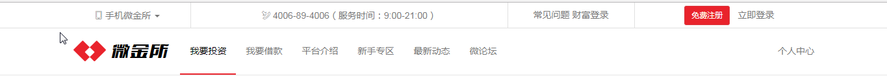

##### 1.**container类**

```
定义一个固定宽度且居中的版心
container是具备响应式的能力
四个档位 1170 970 750 100%
```

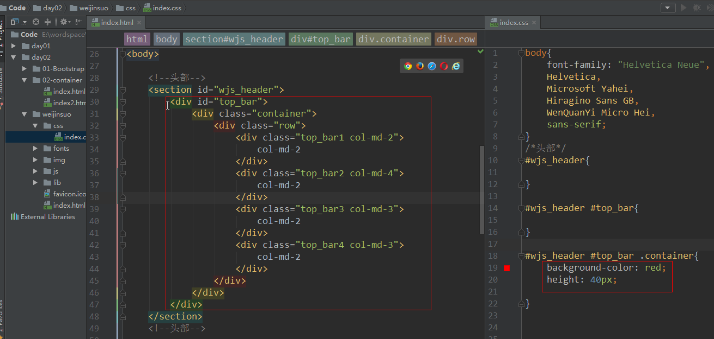

1.探究container具备响应式的能力

```
<!DOCTYPE html>
<html lang="en">
<head>
    <meta charset="UTF-8">
    <title>Title</title>
    <style>
        *{
            margin: 0;
            padding: 0;
        }
        .container{
            height: 30px;
            background-color: red;
            margin:  0 auto;
        }


    </style>
</head>
<body>
    <div class="container">
    </div>
    <!--
        四个档位 1170 970 750 100%
    -->
<script>

    window.onload=function () {
        //1.拿到container标签
        var container = document.querySelector('.container');
        var containerW=0;

        windowChange();

        //2.监听窗口发生改变...
        window.addEventListener('resize',windowChange)
        
        function windowChange() {
            //3.拿到口的宽度
            var windowWidth=window.innerWidth;
            
            if(windowWidth>=1170){
                container.style.width=1170+'px';
            }else if(windowWidth>=970){
                container.style.width=970+'px';
            }else if(windowWidth>=750){
                container.style.width=750+'px';
            }else{
                //...
                container.style.width='100%';
            }
        }
    }
</script>
</body>
</html>
```


##### 2.row类

row类代表一行，一般都是与container类一起结合使用。

并且在栅栏系统中，所有“列（column）必须放在 ” `.row` 内;

**探究container, row , column 的关系**：https://segmentfault.com/a/1190000000743553

例如：

```
<div class="container">
  <div class="row">
    	.....
  </div>
</div>
```


##### 3.栅格系统

所有“列（column）必须放在 ” `.row` 内;  并且`.row`一般放在`.container`内

```
Bootstrap中的栅格系统就是将一行划分为12列
我们通过col-*-*的类名控制某个元素在某种屏幕的情况下展示几列
col-md-6 在中等屏幕下 占1/2
col-xs-12 在超小屏幕下 占全部
```

##### 4.col-\*****-\****\*类

在某种屏幕尺寸下控制列的占比

```
col-xs-[列数]：在超小屏幕下展示几份
col-sm-[列数]：在小屏幕下展示几份
col-md-[列数]：在中等屏幕下展示几份
col-lg-[列数]：在大屏幕下展示几份
__xs__ : 超小屏幕 手机 (<768px)  
__sm__ : 小屏幕 平板 (≥768px) 
__md__ : 中等屏幕 桌面显示器 (≥992px) 
__lg__ : 大屏幕 大桌面显示器 (≥1200px)
```

#### 3 每一列的分解线am

使用兄弟选择器

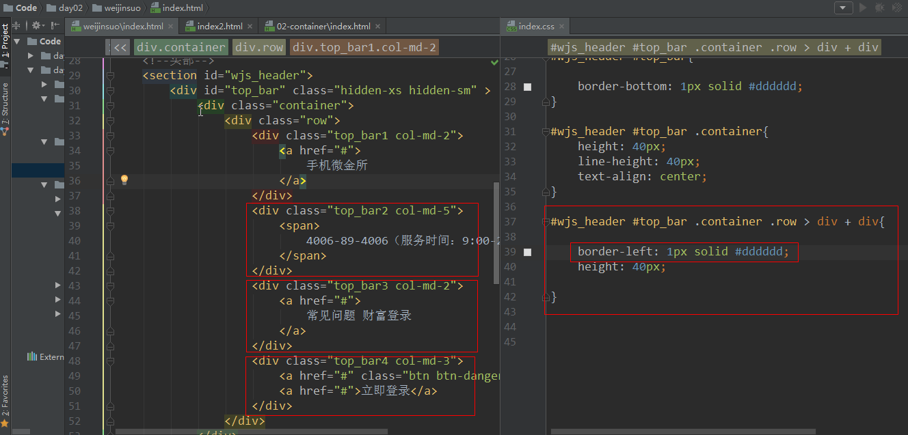

兄弟选择器的探究

```
<!DOCTYPE html>
<html lang="en">
<head>
    <meta charset="UTF-8">
    <title>Title</title>

    <style>
        ul li{
            /*background-color: red;*/
        }
        
        ul li + li{
              /*background-color: green;*/
        }
        
        ul li ~ li{
            /*background-color: pink;*/
        }
        
        .test + li{
            background-color: yellow;
        }
        
    </style>
</head>

<body>

<ul>
    <li class="test">1</li>
    <li>2</li>
    <li>3</li>
    <li>4</li>
    <li>5</li>
    <li>6</li>
</ul>

</body>
</html>
```

#### 4.字体对齐

排版：http://v3.bootcss.com/css/#type-alignment

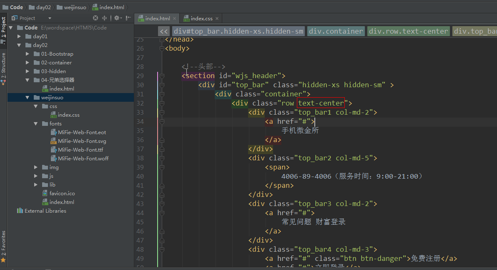

#### 5.字体颜色

辅助类；http://v3.bootcss.com/css/#helper-classes

字体颜色a标签不能继承父类的中的text-xxx

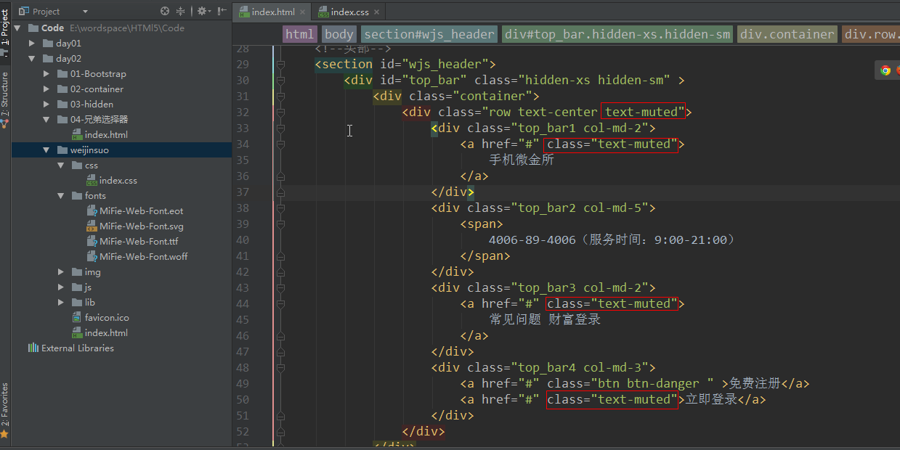

#### 3 字体图标

醉牛前端：http://f2er.club/

阿里巴巴图标库：http://www.iconfont.cn/

制作字体图标网站：https://icomoon.io/

##### 1.生成字体图标：

第一步：

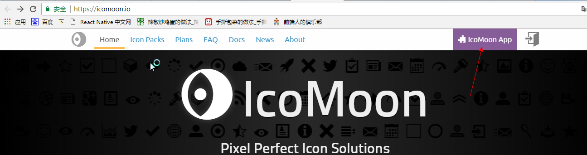

第二步：

直接选择想要的**图标  -->制作成-->字体**

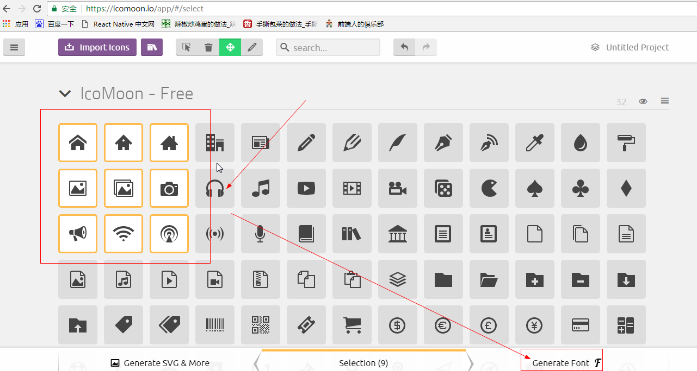

或者导入自己的**图标  -->制作成-->字体**

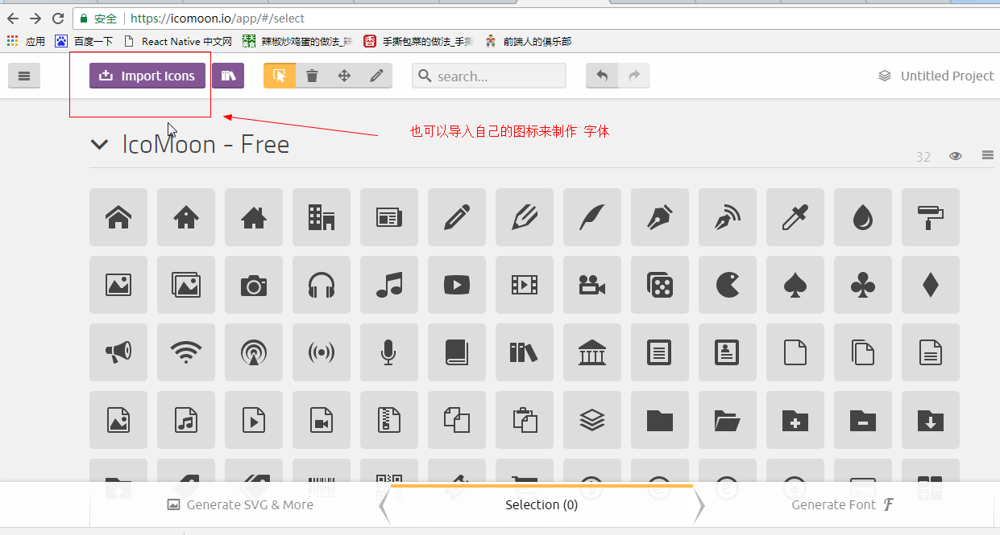

第四步：

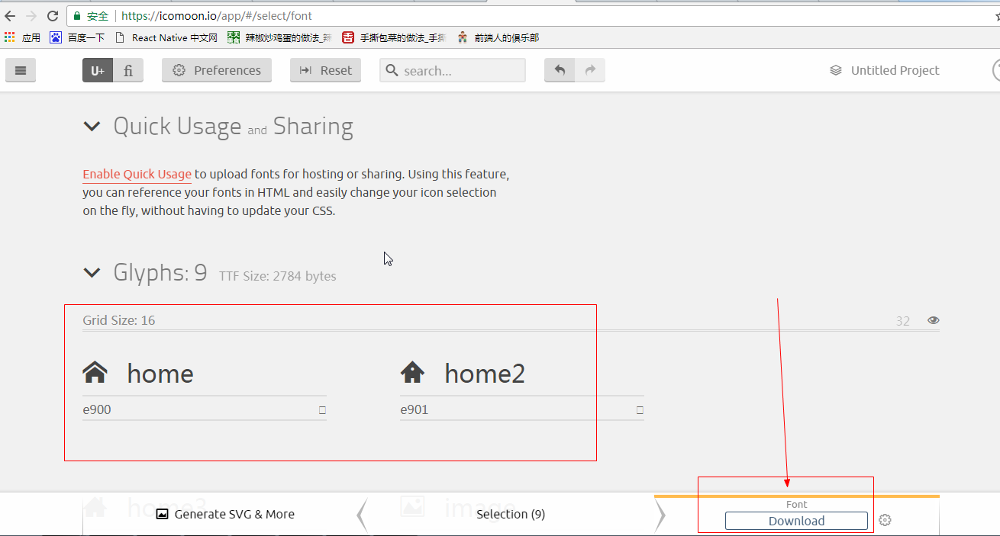

第五步：

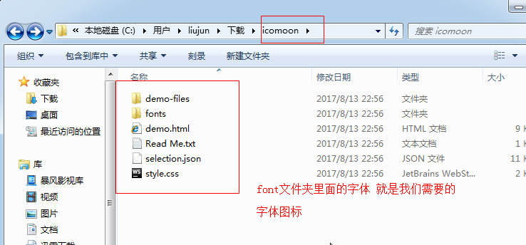


到此我们已经成功将**图片变成字体图标**

##### 2.使用字体图标

第一步：

查看图标对应的字体编码：

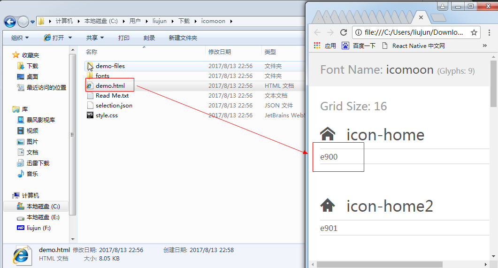

第二步：

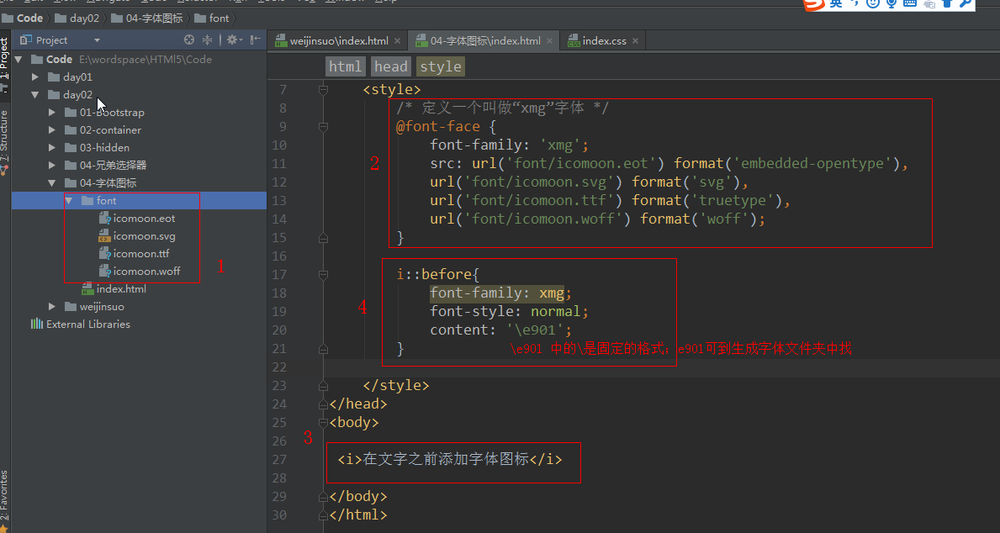

执行效果：


> [*class*^=*value*] 选择器匹配属性值以指定值开头的每个元素。
>
> [*class\**=*value*] 选择器匹配属性值包含指定值开头的每个元素。

最终代码：

```
<!DOCTYPE html>
<html lang="en">
<head>
    <meta charset="UTF-8">
    <title>Title</title>

    <style>
        /* 定义一个叫做“xmg”字体 */
        @font-face {
            font-family: 'xmg';
            src: url('font/icomoon.eot') format('embedded-opentype'),
            url('font/icomoon.svg') format('svg'),
            url('font/icomoon.ttf') format('truetype'),
            url('font/icomoon.woff') format('woff');
        }
        
        /*匹配以icon-开头的class*/
        [class^='icon-'],
        /*匹配存在icon-字符串class*/
        [class*='icon-']{
            font-family: xmg;
            font-style: normal;
        }

        i::before{
            content: '\e901';
        }
        span::before{
            content: '\e91a';
        }
        div::before{
            content: '\e90f';
        }
    </style>
</head>
<body>
 <i class="icon-i">在i之前添加字体图标</i>
 <span class="icon-span">在sapn之前添加字体图标</span>
 <div class="icon-div">在div之前添加字体图标</div>
</body>
</html>
```


##### 3.微金所字体图标

###### 1.使用bootstrap字体图标

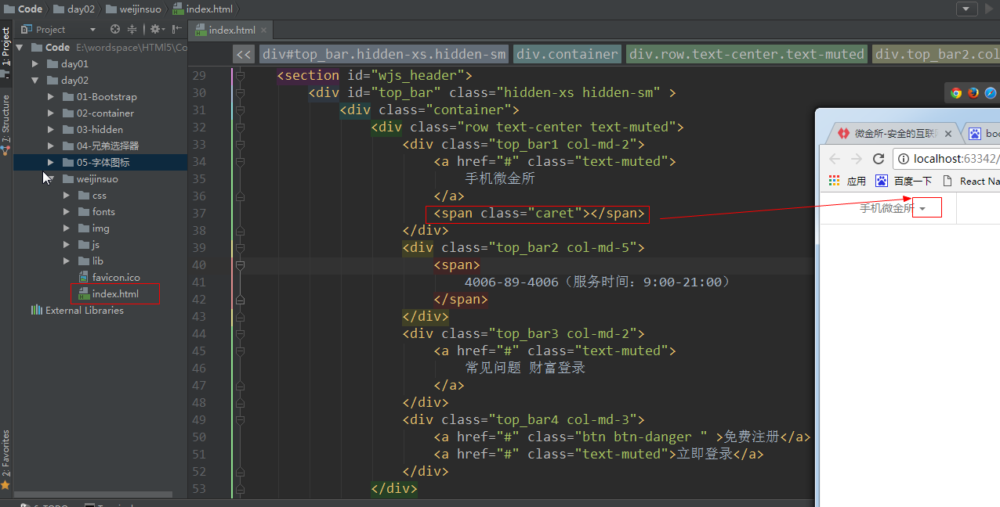


###### 2.使用自定义的字体图标

1.引入字体

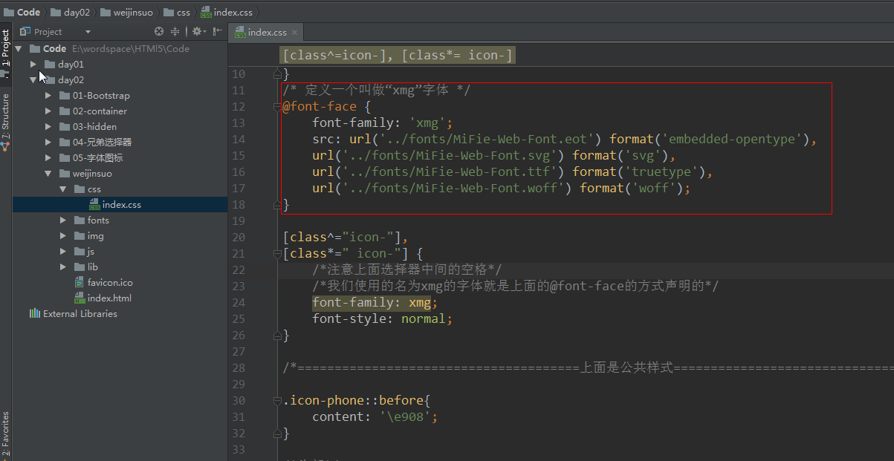

```
 /* 定义一个叫做“xmg”字体
 	引用多种字体的目的是适配各种机型
 */
@font-face {
    font-family: 'xmg';
    src: url('../fonts/MiFie-Web-Font.eot') format('embedded-opentype'),
    url('../fonts/MiFie-Web-Font.svg') format('svg'),
    url('../fonts/MiFie-Web-Font.ttf') format('truetype'),
    url('../fonts/MiFie-Web-Font.woff') format('woff');
}
```

- **字体文件格式**

  eot : embedded-opentype

  svg : svg

  ttf : truetype

  woff : woff


2.定义字体样式

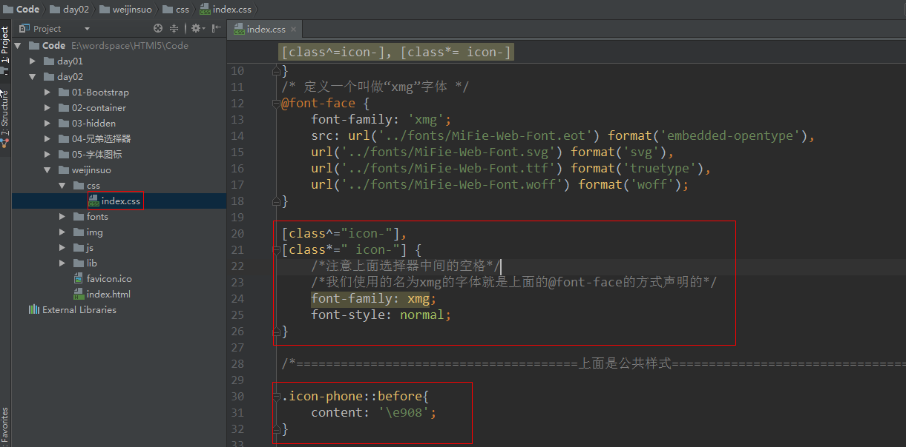

```

[class^="icon-"],
[class*=" icon-"] {
  /*注意上面选择器中间的空格*/
  /*我们使用的名为xmg的字体就是上面的@font-face的方式声明的*/
  font-family: xmg;
  font-style: normal;
}

.icon-phone::before{
  content: '\e908';
}
```


> [*class*^=*value*] 选择器匹配属性值以指定值开头的每个元素。
>
> [*class\**=*value*] 选择器匹配属性值包含指定值开头的每个元素。

3.布局中使用字体样式:   \e908

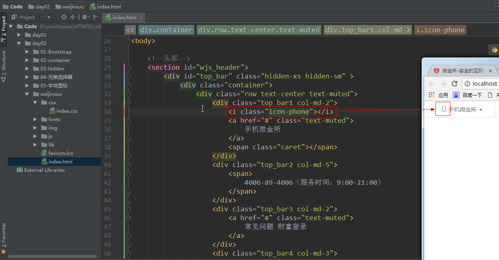

```
    <!--头部-->
    <section id="wjs_header">
        <div id="top_bar" class="hidden-xs hidden-sm" >
            <div class="container">
                <div class="row text-center text-muted">
                    <div class="top_bar1 col-md-2">
                        <i class="icon-phone"></i>
                        <a href="#" class="text-muted">
                            手机微金所
                        </a>
                        <span class="caret"></span>
                    </div>
                    <div class="top_bar2 col-md-5">
                        <span>
                            4006-89-4006（服务时间：9:00-21:00）
                        </span>
                    </div>
                    <div class="top_bar3 col-md-2">
                        <a href="#" class="text-muted">
                            常见问题 财富登录
                        </a>
                    </div>
                    <div class="top_bar4 col-md-3">
                        <a href="#" class="btn btn-danger " >免费注册</a>
                        <a href="#" class="text-muted">立即登录</a>
                    </div>
                </div>
            </div>
        </div>
    </section>
```

4.布局使用电话字体样式:    \e909

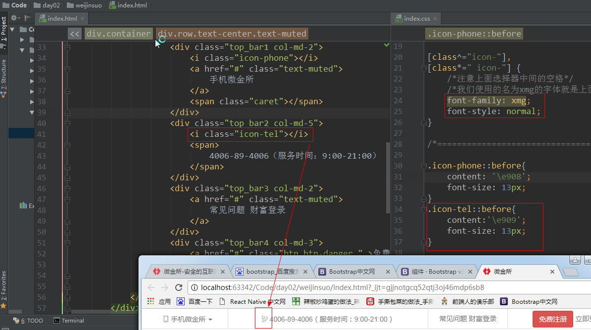


#### 4 二维码图片展示

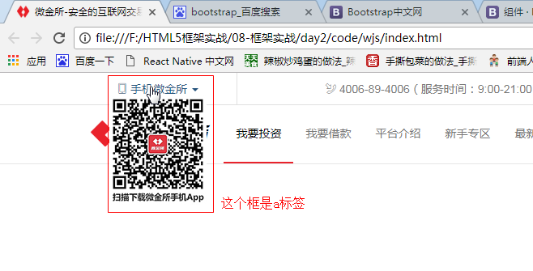1.

##### 1.实现布局

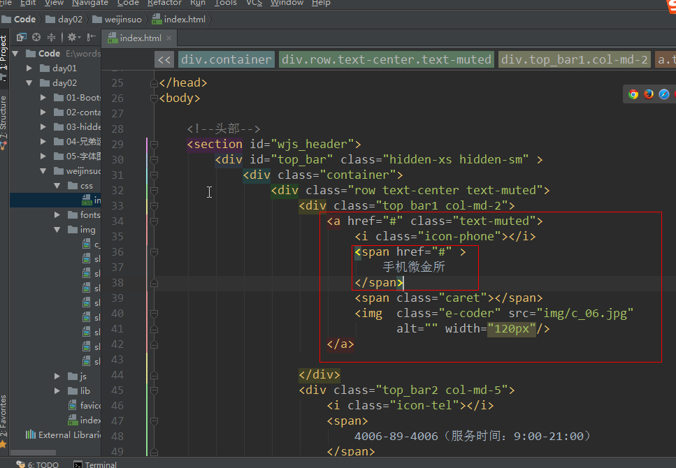

执行效果

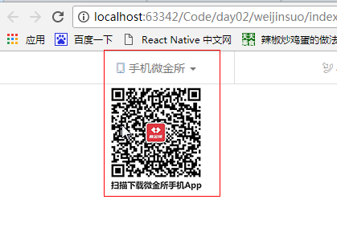

##### 2.默认隐藏, 鼠标浮动在a标签上面时显示

```
#top_bar .container .row .e-coder{
    display: none;
}

#top_bar .container a:hover .e-coder{
    display: inline-block;
}
```

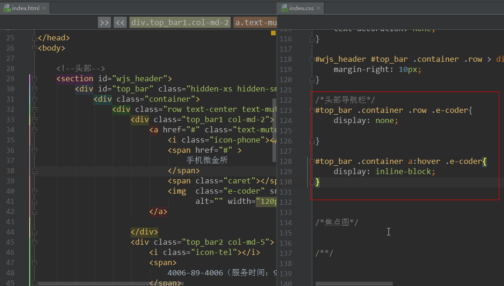

##### 3.定位

相对class='top_bar1 col-md-2' 这个标签 来定位

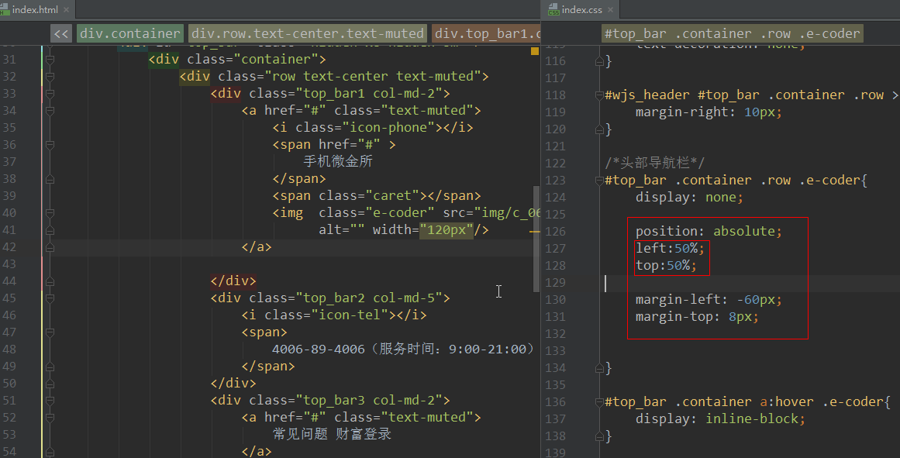

##### 4.二维码至顶层

```
#top_bar .container .row .e-coder{
    display: none;

    position: absolute;
    left:50%;
    top:50%;

    margin-left: -60px;
    margin-top: 8px;
	/*至顶层*/
    z-index: 9999;
}
```


#### 5 按钮样式

##### 1.按钮样式-的重写

```

.btn-xmg {
  color: #fff;
  background-color: #d9534f;
  border-color: #d43f3a;
}
.btn-xmg:focus,
.btn-xmg.focus {
  color: #fff;
  background-color: #c9302c;
  border-color: #761c19;
}
.btn-xmg:hover {
  color: #fff;
  background-color: #c9302c;
  border-color: #ac2925;
}
.btn-xmg:active,
.btn-xmg.active,
.open > .dropdown-toggle.btn-danger {
  color: #fff;
  background-color: #c9302c;
  border-color: #ac2925;
}
.btn-xmg:active:hover,
.btn-xmg.active:hover,
.open > .dropdown-toggle.btn-danger:hover,
.btn-xmg:active:focus,
.btn-xmg.active:focus,
.open > .dropdown-toggle.btn-danger:focus,
.btn-xmg:active.focus,
.btn-xmg.active.focus,
.open > .dropdown-toggle.btn-danger.focus {
  color: #fff;
  background-color: #ac2925;
  border-color: #761c19;
}
.btn-xmg:active,
.btn-xmg.active,
.open > .dropdown-toggle.btn-danger {
  background-image: none;
}
.btn-xmg.disabled:hover,
.btn-xmg[disabled]:hover,
fieldset[disabled] .btn-danger:hover,
.btn-xmg.disabled:focus,
.btn-xmg[disabled]:focus,
fieldset[disabled] .btn-danger:focus,
.btn-xmg.disabled.focus,
.btn-xmg[disabled].focus,
fieldset[disabled] .btn-danger.focus {
  background-color: #d9534f;
  border-color: #d43f3a;
}
.btn-xmg .badge {
  color: #d9534f;
  background-color: #fff;
}
```

##### 2.按钮样式-自动生成

http://blog.koalite.com//bbg//

```
ffffff  E9232C  DB3B43  E9232C
```

- 可以通过界面生成一个新的按钮样式
- 具体代码

```
.btn-xmg { 
  color: #FFFFFF; 
  background-color: #E9232C; 
  border-color: #DB3B43; 
} 
 
.btn-xmg:hover, 
.btn-xmg:focus, 
.btn-xmg:active, 
.btn-xmg.active, 
.open .dropdown-toggle.btn-xmg { 
  color: #FFFFFF; 
  background-color: #E9232C; 
  border-color: #DB3B43; 
} 
 
.btn-xmg:active, 
.btn-xmg.active, 
.open .dropdown-toggle.btn-xmg { 
  background-image: none; 
} 
 
.btn-xmg.disabled, 
.btn-xmg[disabled], 
fieldset[disabled] .btn-xmg, 
.btn-xmg.disabled:hover, 
.btn-xmg[disabled]:hover, 
fieldset[disabled] .btn-xmg:hover, 
.btn-xmg.disabled:focus, 
.btn-xmg[disabled]:focus, 
fieldset[disabled] .btn-xmg:focus, 
.btn-xmg.disabled:active, 
.btn-xmg[disabled]:active, 
fieldset[disabled] .btn-xmg:active, 
.btn-xmg.disabled.active, 
.btn-xmg[disabled].active, 
fieldset[disabled] .btn-xmg.active { 
  background-color: #E9232C; 
  border-color: #DB3B43; 
} 
 
.btn-xmg .badge { 
  color: #E9232C; 
  background-color: #FFFFFF; 
}
```

##### 3.按钮变小

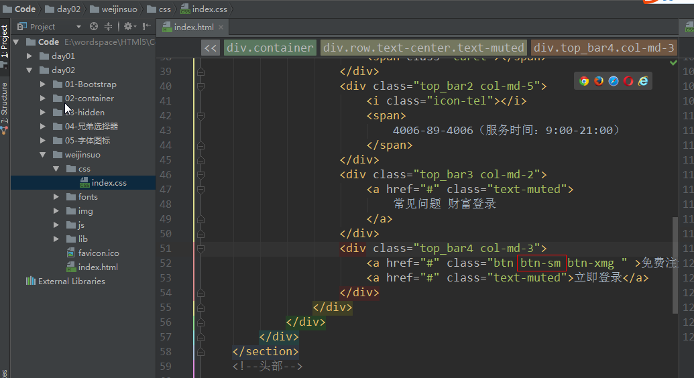

#### 6 小屏幕隐藏

响应式工具：http://v3.bootcss.com/css/#responsive-utilities

```
<div class="topbar hidden-xs hidden-sm"></div>
//  或者
<div class="topbar visible-md visible-lg"></div>
```

> __hidden-xx__ : 在某种屏幕下隐藏( display : ‘none’ )
>
> __visible-xx-xxx__ : 在某种屏幕尺寸下显示
>
> visible-md-xx：指的是中等屏幕可见，不是中等屏幕以上
>
> visible-md-block visible-lg-block == hidden-sm hidden-xs


根据hidden-xxx的特点，我们可以通过**媒体查询**的方式探究探究：

```
<!--
.hidden-xs  < 768
.hidden-sm  [768, 992)
.hidden-md  [992, 1200)
.hidden-lg  >= 1200
-->

<!DOCTYPE html>
<html lang="en">
<head>
    <meta charset="UTF-8">
    <title>Title</title>
    <style>
        .container{
            width: 300px;
            height: 300px;
            background-color: red;
            margin: 20px auto;
        }

        @media screen and (max-width: 768px){
            .hidden-xs{
                display: none;
            }
        }

        @media screen and (min-width: 768px) and (max-width: 992px){
            .hidden-sm{
                display: none;
            }
        }

        @media screen and (min-width: 992px) and (max-width: 1200px){
            .hidden-md{
                display: none;
            }
        }

        @media screen and (min-width: 1200px){
            .hidden-lg{
                display: none;
            }
        }
    </style>
</head>

<!--
.hidden-xs  < 768
.hidden-sm  [768, 992)
.hidden-md  [992, 1200)
.hidden-lg  >= 1200
-->

<body>
    <div class="container hidden-sm ">
    </div>
</body>
</html>
```

2.根据visible-xxx的特点，我们可以通过**媒体查询**的方式探究探究：

```
<!--
    .visible-xs-block
    .visible-xs-inline
    .visible-xs-inline-block
-->

<!DOCTYPE html>
<html lang="en">
<head>
    <meta charset="UTF-8">
    <title>Title</title>
    <style>
        .container{
            width: 300px;
            height: 300px;
            background-color: red;
            margin: 20px auto;
            display: none;
        }

        @media screen and (max-width: 768px){
            .visible-xs-block{
                display: block;
            }
            .visible-xs-inline{
                display: inline;
            }
            .visible-xs-inline-block{
                display: inline-block;
            }
        }

        @media screen and (min-width: 768px) and (max-width: 992px){
            .visible-sm-block{
                display: block;
            }
            .visible-sm-inline{
                display: inline;
            }
            .visible-sm-inline-block{
                display: inline-block;
            }
        }

        @media screen and (min-width: 992px) and (max-width: 1200px){
            .visible-md-block{
                display: block;
            }
            .visible-md-inline{
                display: inline;
            }
            .visible-md-inline-block{
                display: inline-block;
            }
        }

        @media screen and (min-width: 1200px){
            .visible-lg-block{
                display: block;
            }
            .visible-lg-inline{
                display: inline;
            }
            .visible-lg-inline-block{
                display: inline-block;
            }
        }
    </style>
</head>
<!--
    .visible-xs-block
    .visible-xs-inline
    .visible-xs-inline-block
-->

<body>
    <div class="container visible-xs-block">

    </div>
    <p>我是p</p>
</body>
</html>

```

#### 7.立即登录

###### 1.定义模态框

模态框：http://v3.bootcss.com/javascript/#modals

模态框的  id="wjs-login" 

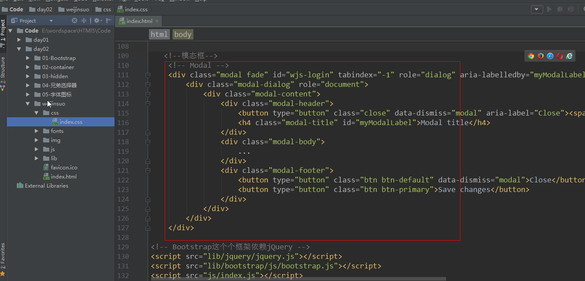

```
    <!--模态框:
        role: 是用来增强语义性，没有什么其它功能，可以删除。
        aria-xxx : 是屏幕阅读辅助，兼容残障人使用的设备
    -->
    <div class="modal fade" id="wjs-login" tabindex="-1" role="dialog" aria-labelledby="myModalLabel">
        <div class="modal-dialog" role="document">
            <div class="modal-content">
                <div class="modal-header">
                    <button type="button" class="close" data-dismiss="modal" aria-label="Close"><span aria-hidden="true">&times;</span></button>
                    <h4 class="modal-title" id="myModalLabel">Modal title</h4>
                </div>
                <div class="modal-body">
                    ...
                </div>
                <div class="modal-footer">
                    <button type="button" class="btn btn-default" data-dismiss="modal">Close</button>
                    <button type="button" class="btn btn-primary">Save changes</button>
                </div>
            </div>
        </div>
    </div>
```

###### 2.登录按钮指定一个要弹出的模态框

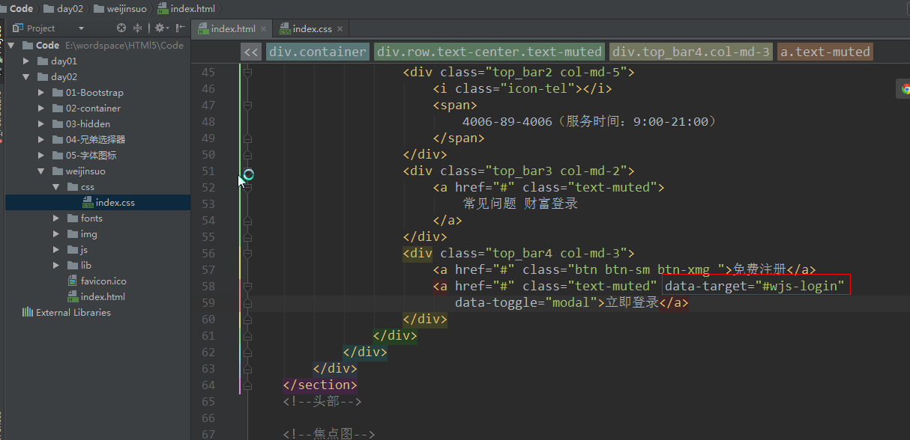

###### 3.指定以模态框的方式弹出

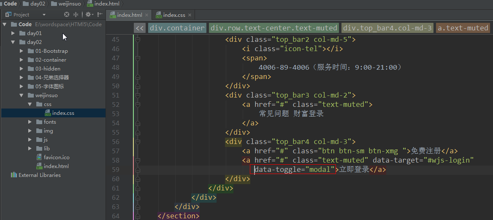

执行效果：

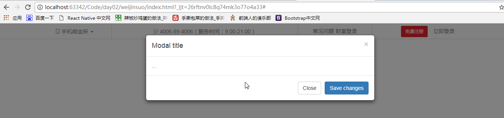

4.修改模态框的标题和按钮

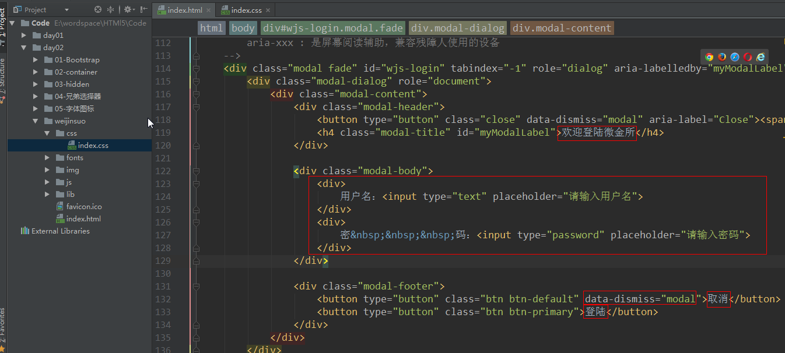

执行效果：

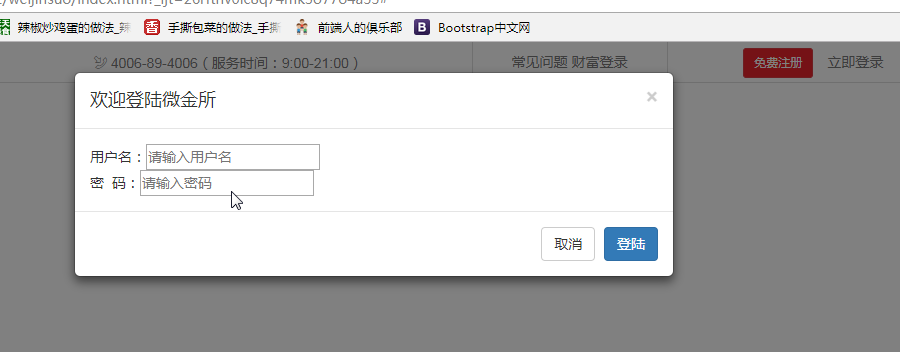

#### 7 导航通栏

##### 1.导航通栏的介绍

###### 1.新建一个项目

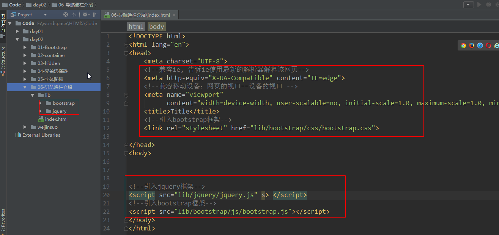

###### 2.引入导航栏

导航条组件：http://v3.bootcss.com/components/#nav


**注意事项：**

使用boostrap的组件，**第一件事要修改id** ，id是唯一的。因为该组件可能会被多次使用，所以一定要改id。

```
<!--
    data-toggle="collapse"　指定以折叠的方式切换目标
    data-target="#nav_content"  指定要折叠的目标
    
    data-toggle="modal"　   指定以模态框的方式打开目标
    data-toggle="dropdown"  指定以下拉的方式打开目标
    
    role: 增强语意性
    sr-only 和 aria-xx : 屏幕阅读辅助，例如盲人-->
```

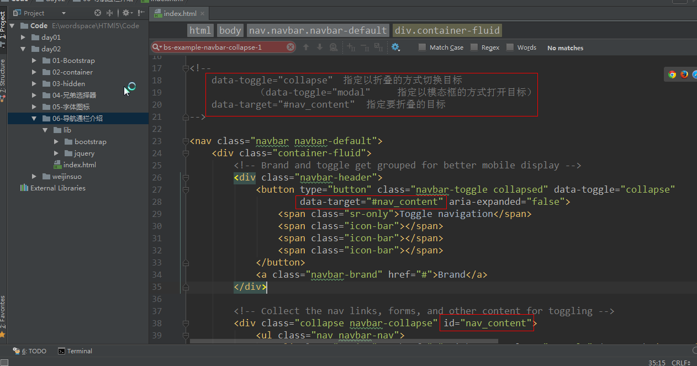

##### 2.项目集成导航通栏

###### 1.引入导航条

修改id  ， 静止在顶部 ， 给固定的宽度

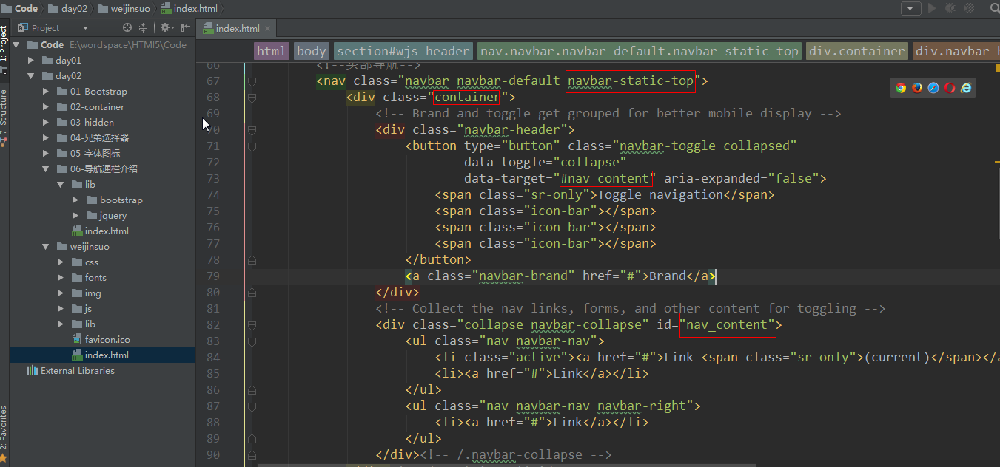

执行的效果：

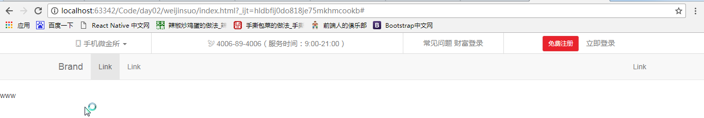

###### 2.修改导航条的样式：

背景颜色 ，marginBottom , 

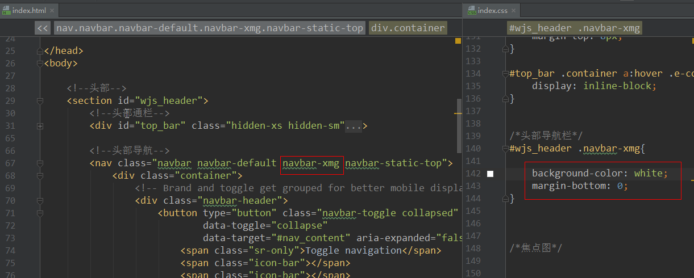

###### 3.完善导航条内容

```

        <!--头部导航-->
        <nav class="navbar navbar-default navbar-xmg navbar-static-top">
            <div class="container">
                <!-- Brand and toggle get grouped for better mobile display -->
                <div class="navbar-header">
                    <button type="button" class="navbar-toggle collapsed"
                            data-toggle="collapse"
                            data-target="#nav_content" aria-expanded="false">
                        <span class="sr-only">Toggle navigation</span>
                        <span class="icon-bar"></span>
                        <span class="icon-bar"></span>
                        <span class="icon-bar"></span>
                    </button>
                    <a class="navbar-brand" href="#">Brand</a>
                </div>
                <!-- Collect the nav links, forms, and other content for toggling -->
                <div class="collapse navbar-collapse" id="nav_content">
                    <ul class="nav navbar-nav">
                    
                        <li class="active"><a href="#">我要投资</a></li>
                        <li><a href="#">我要借款</a></li>
                        <li><a href="#">平台介绍</a></li>
                        <li><a href="#">新手专区</a></li>
                        <li><a href="#">最新动态</a></li>
                        <li><a href="#">微论坛</a></li>
                        
                    </ul>
                    <ul class="nav navbar-nav navbar-right">
                    
                        <li><a href="#">个人中心</a></li>
                        
                    </ul>
                </div><!-- /.navbar-collapse -->
            </div><!-- /.container-fluid -->
        </nav>
```

###### 4.添加品牌logo和微金所

```
e920   #E9232C     50px
e93e   #000        36px
```

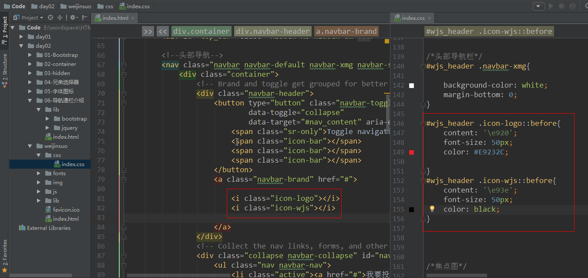

执行效果：

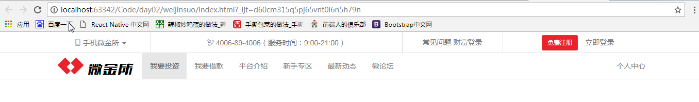

###### 5.字体图标居中

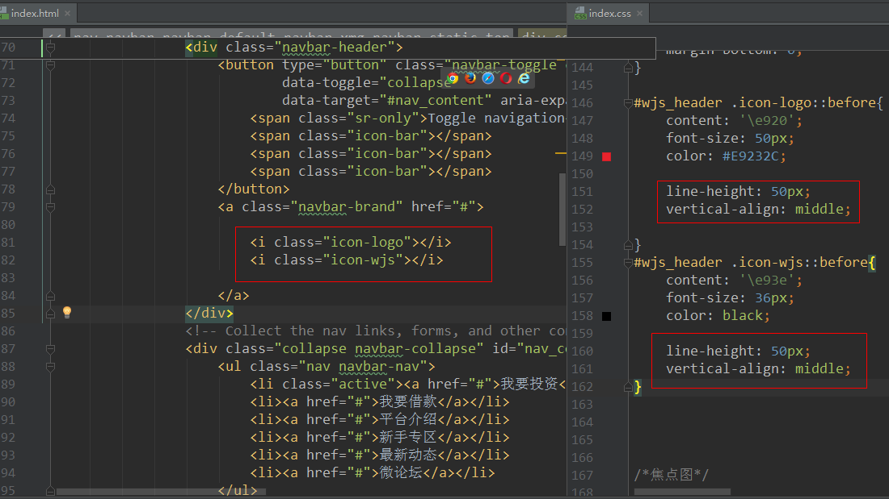

###### 6.修改navbar-banner的高度

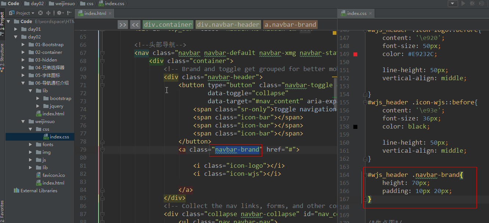

执行效果：

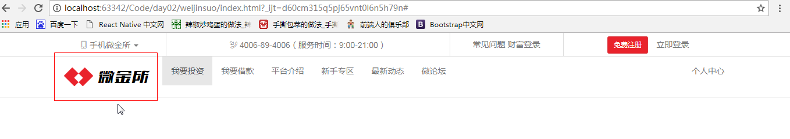

###### 7.设计字体的行高

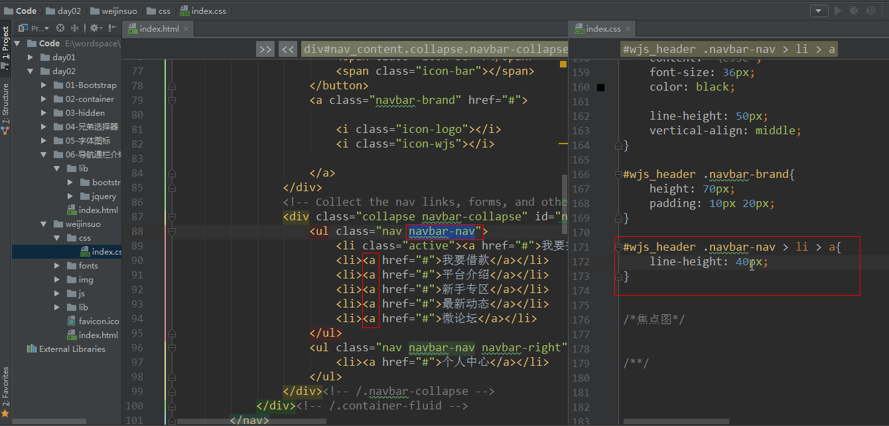

执行的效果：

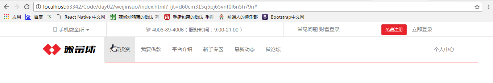

###### 8.个人中心--设计为大屏可见

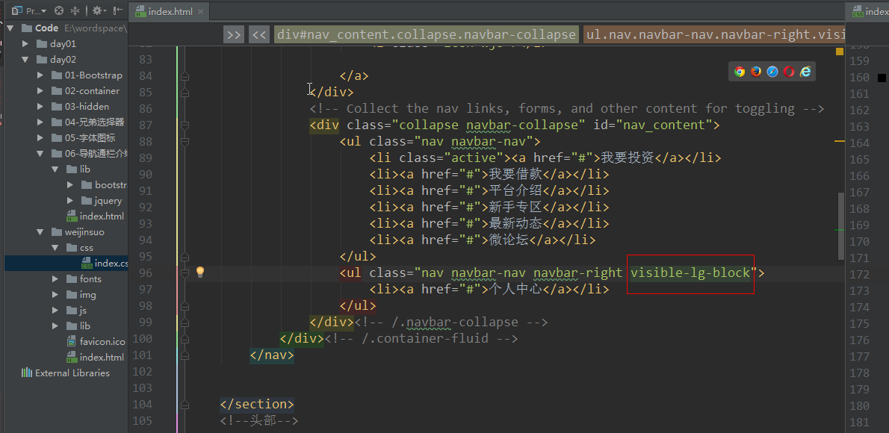

###### 9.修改头部按钮的样式

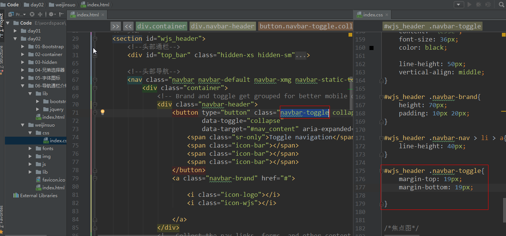

执行效果：

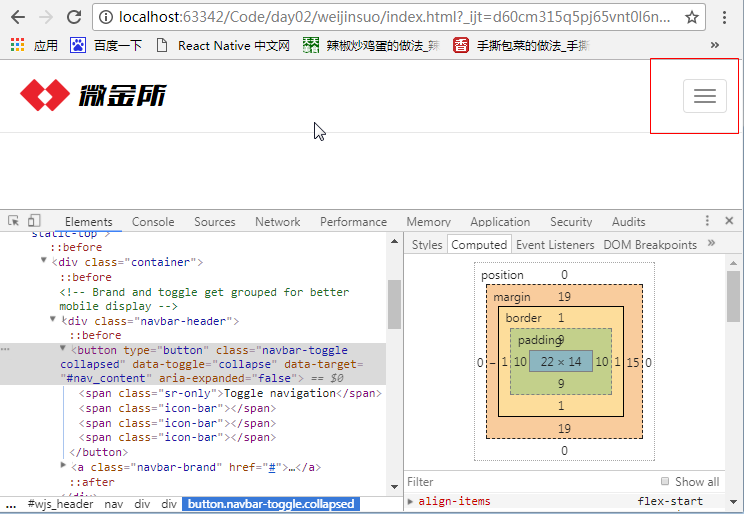


###### 10.默认选中--我要投资

```
#wjs_header .navbar-nav .active>a{
    background-color: transparent;
    color: #000;
    border-bottom: 2px solid #E9232C;
}
```

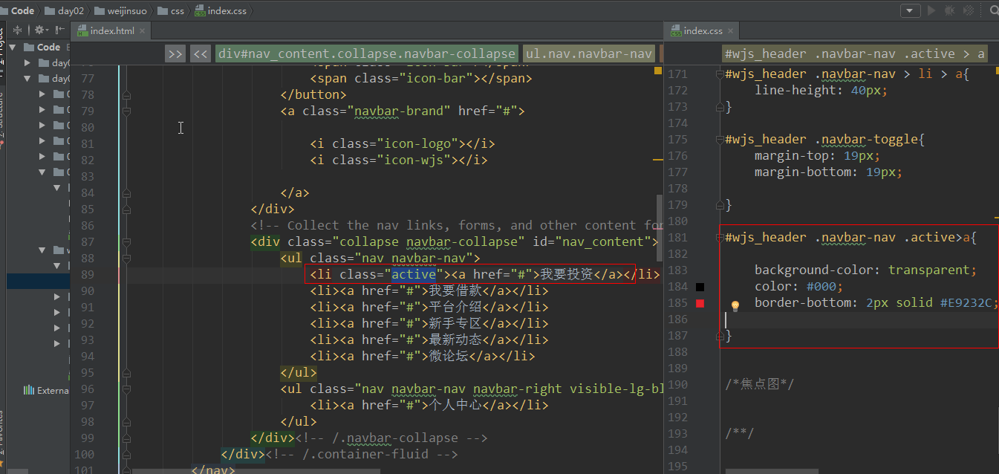

###### 11.选中其它的标签

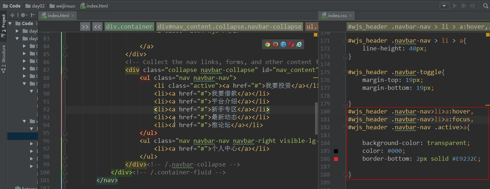


- 响应式菜单

> 默认菜单是不具备响应式的能力的，通过观察文档发现，响应式菜单是通过一个按钮控制的

```
<nav class="navbar navbar-default navbar-xmg navbar-static-top">
  <div class="container">
    <div class="navbar-header">
      <!-- 点击该按钮会切换菜单的显示或隐藏 -->
      <button 
        id="btn" 
        type="button" 
        class="navbar-toggle collapsed" 
        data-toggle="collapse" 
        data-target="#nav_list" 
        aria-expanded="false"
      >
        <span class="sr-only">切换菜单</span>
        <span class="icon-bar"></span>
        <span class="icon-bar"></span>
        <span class="icon-bar"></span>
      </button>
      <a class="navbar-brand" href="#">
        <i class="icon-icon"></i>
        <i class="icon-logo"></i>
      </a>
    </div>
    <div id="nav_list" class="collapse navbar-collapse">
      <ul class="nav navbar-nav">
        <li class="active"><a href="#">我要投资</a></li>
        <li><a href="#">我要借款</a></li>
        <li><a href="#">平台介绍</a></li>
        <li><a href="#">新手专区</a></li>
        <li><a href="#">最新动态</a></li>
        <li><a href="#">微论坛</a></li>
      </ul>
      <ul class="nav navbar-nav navbar-right hidden-sm">
        <li><a href="#">个人中心</a></li>
      </ul>
    </div>
  </div>
</nav>
```

#### 8.焦点图

##### 1.焦点图介绍

轮播图（焦点图）carousel：http://v3.bootcss.com/javascript/#carousel

###### 1.新建一个项目

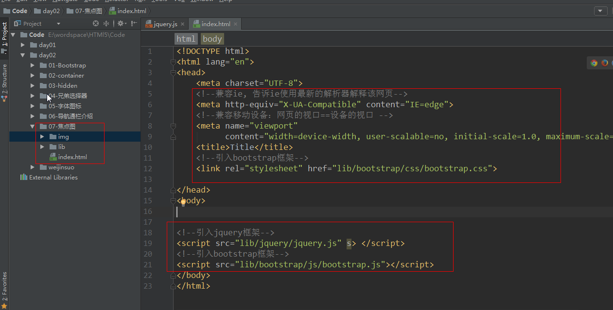

###### 2.引入焦点图

**第一件事 修改id ， 图片的切换时通过id来实现的**

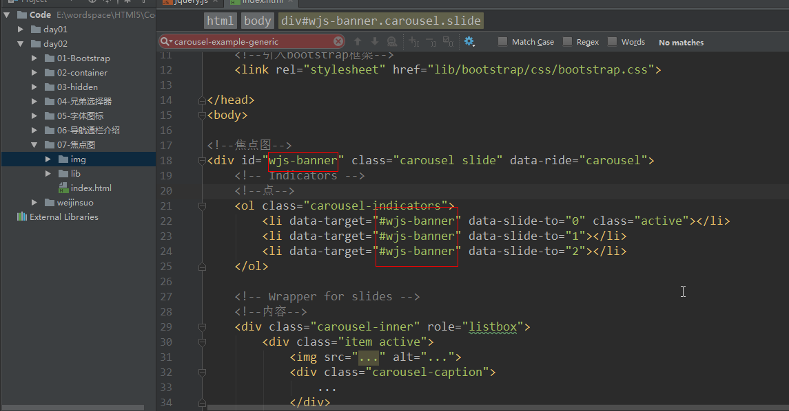

###### 3.添加小图

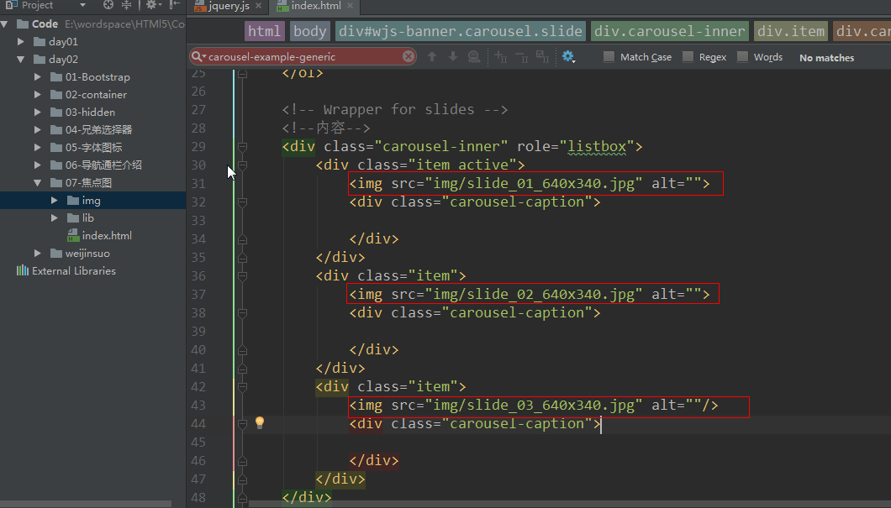

执行效果：

在小屏幕的效果

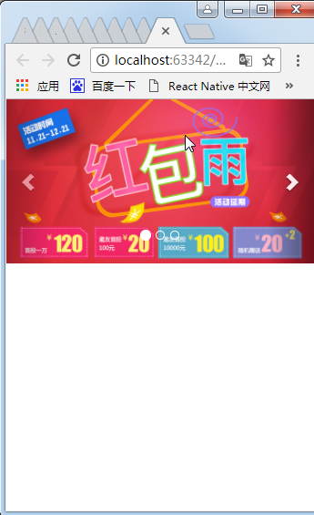

在大屏幕的效果：

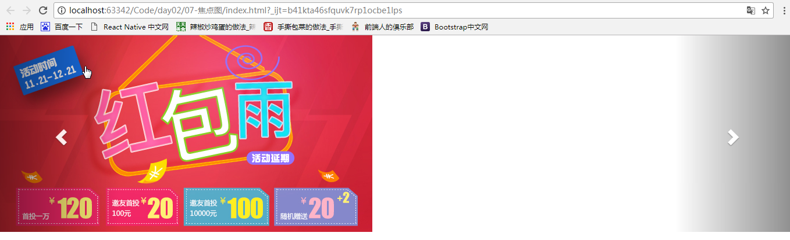

###### 4添加大图

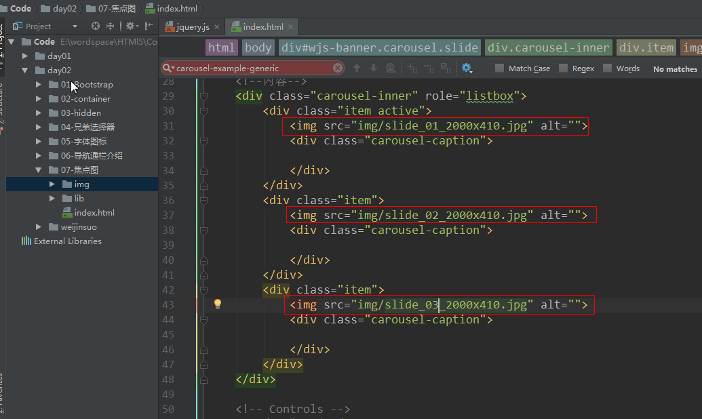

执行的效果：

在小屏幕的效果：

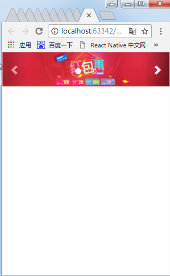

在大屏幕的效果：

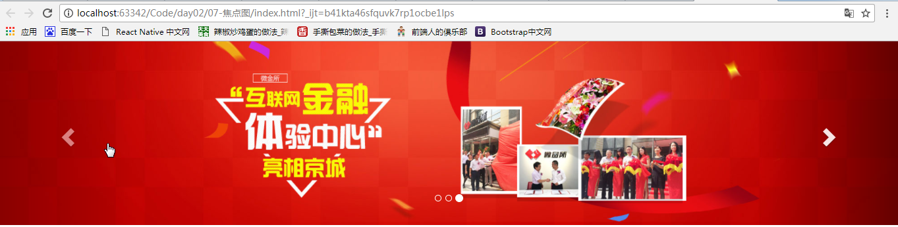

###### 5.给轮播图添加固定的高度

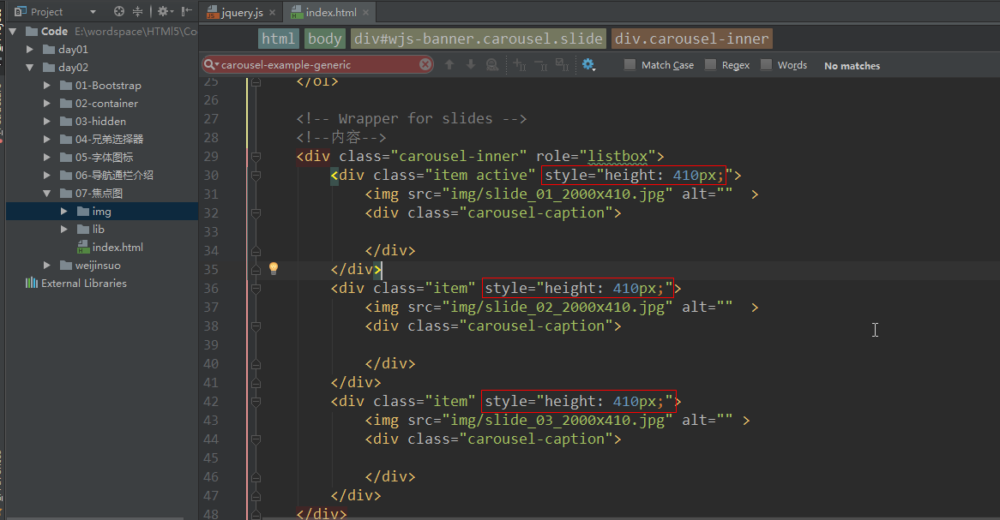


###### 7


